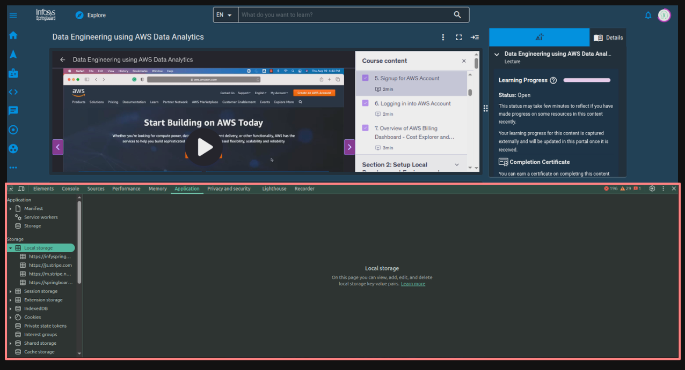
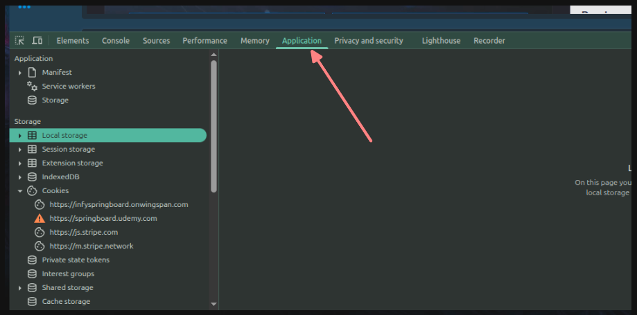
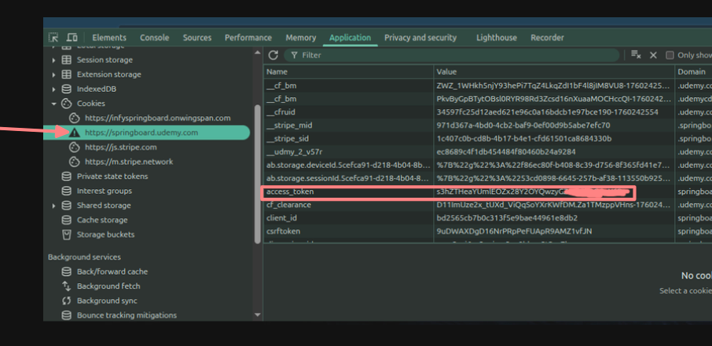

# This script marks the lectures as completed in springboard udemy course

Specifically made for this course, but can be easily tweaked for other udemy courses on springboard.

> https://infyspringboard.onwingspan.com/web/en/app/toc/lex_auth_014157693046718464160/overview

## Why I made it

Neither was I able to found any working solutions to do this task, nor I had enough hours to waste on this course at that moment.

## How to use it

- Make sure python is installed in your system. If not, go to google and following along any installation guide. After that proceed with this.
- Clone this repo or copy pase the code in script.py on your system.

### How to get access_token

- Log in to your infosys springboard account.
- Open the course from the link above.
- Start the course and wait on the loading page of Udemy.
- Once udemy is loaded, open the `Developer tools` (Press F12 key or Ctrl+Shift+I or Right click --> Inspect).
- Open applications tab
- Go to Cookies and look for access_token value as shown below:
- Copy the access_token value and put it in the config file.

### Preparing python environment

- Create a virtual environment using this command and name your environment as per your convenience

```console
    python3 -m venv your_environment_name
```

#### Activate the Virtual Environment:

- On Linux/macOS:

```console
source your_environment_name/bin/activate
```

- On Windows (Using Command Prompt):

```console
my_project_env\Scripts\activate.bat
```

- On Windows (Using PowerShell):

```console
my_project_env\Scripts\Activate.ps1
```

### Run the script

- Install following package requirements

```console
pip3 install requests python-dotenv
```

- Run the script

```console
python3 script.py
```

- After course completion, close the python virtual environment

```console
    deactivate
```

---

## NOTE: Open for contribution
